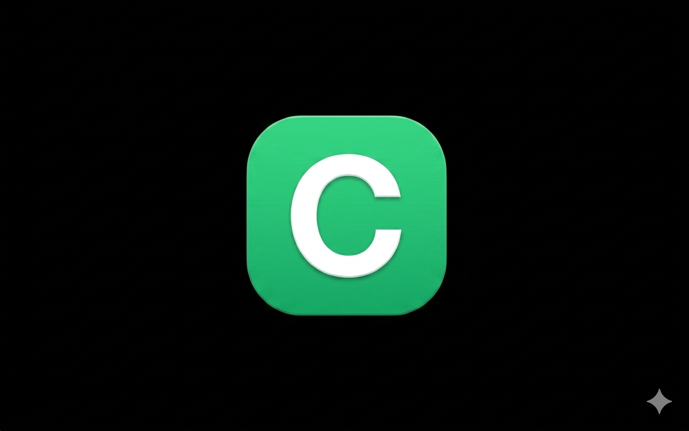
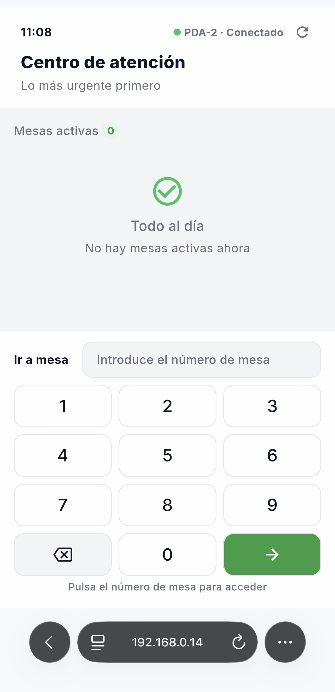

# ConectaMesa

  

  Sistema de gestión operativa para hostelería desarrollado con Java, Spring Boot, PostgreSQL, Flutter y Docker.

  Proyecto iniciado como Trabajo Final de DAM y actualmente en evolución como plataforma de gestión para bares, cafeterías y restaurantes.

---

## ¿Qué es ConectaMesa?

ConectaMesa no es únicamente una carta digital ni un TPV.

Es un sistema diseñado para coordinar clientes, camareros, cocina y caja dentro de un mismo flujo operativo.

Su objetivo es mejorar la gestión de pedidos sin perder el control del servicio.

---

## Problema

Durante las pruebas realizadas en establecimientos de hostelería observé un problema común:

Muchos sistemas de autocomanda permiten que los clientes envíen pedidos directamente a cocina.

Cuando varios clientes realizan pedidos simultáneamente aparecen problemas operativos:

- Saturación de cocina
- Acumulación de tickets
- Pérdida de control del servicio
- Errores en pedidos
- Aumento de tiempos de espera

---

## Solución

ConectaMesa mantiene la digitalización del proceso sin eliminar el papel operativo del camarero.

El cliente puede consultar la carta y realizar pedidos desde su dispositivo móvil, pero el sistema incorpora mecanismos de control que regulan cuándo y cómo los pedidos avanzan hacia cocina y barra.

---

## Ecosistema

### Cliente

- Acceso mediante QR
- Gestión mediante PIN de mesa
- Carta digital
- Creación de pedidos
- Consulta de cuenta

### PDA Camarero

- Gestión de mesas
- Gestión de pedidos
- Envío de comandas
- Supervisión operativa
- Gestión de incidencias

### TPV

- Gestión de mesas activas
- Operaciones de cobro
- Gestión de pedidos
- Control del servicio

### Cocina y Barra

- Recepción de comandas
- Visualización de pedidos
- Gestión de estados
- Impresión térmica

---

## Capturas

### PDA Camarero

  

### TPV

  

---

## Arquitectura

### Backend

- Java 17
- Spring Boot
- Spring Data JPA
- Hibernate
- REST API

### Frontend

- Flutter
- Flutter Web
- Flutter Desktop
- Flutter Mobile

### Base de Datos

- PostgreSQL

### Infraestructura

- Docker
- Docker Compose
- Nginx

---

## Componentes Principales

### Gestión de Mesas

- Apertura de mesa
- Gestión de comensales
- Generación de PIN
- Control de sesión activa

### Gestión de Pedidos

- Creación de pedidos
- Gestión de líneas
- Confirmación de pedido
- Estados de negocio

### Gestión Operativa

- Control de flujo de pedidos
- Gestión de cocina y barra
- Monitor operativo
- Validaciones de servicio

### Gestión de Pagos

- Solicitud de cuenta
- Registro de cobros
- Liberación de mesa

---

## Aspectos Técnicos Trabajados

- Diseño de APIs REST
- Arquitectura cliente-servidor
- Modelado de dominio
- PostgreSQL
- JPA / Hibernate
- Dockerización
- Flutter
- Gestión de estados de negocio
- Integración TPV + PDA + Cliente
- Impresión térmica ESC/POS
- Git y control de versiones

---

## Mi Participación

Proyecto desarrollado como iniciativa personal.

Responsabilidades principales:

- Diseño funcional del producto
- Análisis de necesidades operativas de hostelería
- Arquitectura backend
- Desarrollo de APIs REST
- Diseño de base de datos PostgreSQL
- Desarrollo frontend Flutter
- Dockerización de la plataforma
- Definición de reglas de negocio
- Diseño de flujos operativos

---

## Tecnologías Utilizadas

### Backend

- Java
- Spring Boot
- Spring Data JPA
- Hibernate
- Lombok

### Base de Datos

- PostgreSQL

### Frontend

- Flutter
- Dart

### Infraestructura

- Docker
- Docker Compose
- Nginx

### Herramientas

- Git
- GitHub
- Postman

---

## Estado Actual

Actualmente ConectaMesa continúa evolucionando como plataforma de gestión para hostelería.

Líneas de evolución previstas:

- Gestión avanzada de usuarios
- Control de accesos
- Multiestablecimiento
- Analítica operativa
- Métricas de negocio
- Modelo SaaS

---

## Repositorio Showcase

Este repositorio es una versión Showcase creada con fines profesionales.

Su objetivo es mostrar la arquitectura, funcionalidades y tecnologías utilizadas en el proyecto sin exponer componentes internos de la plataforma completa.

---

## Contacto

LinkedIn

www.linkedin.com/in/anibal-solano-f

GitHub

https://github.com/jav-anibal

---

Desarrollado por Aníbal Solano
DAM · ASIR · Backend Developer