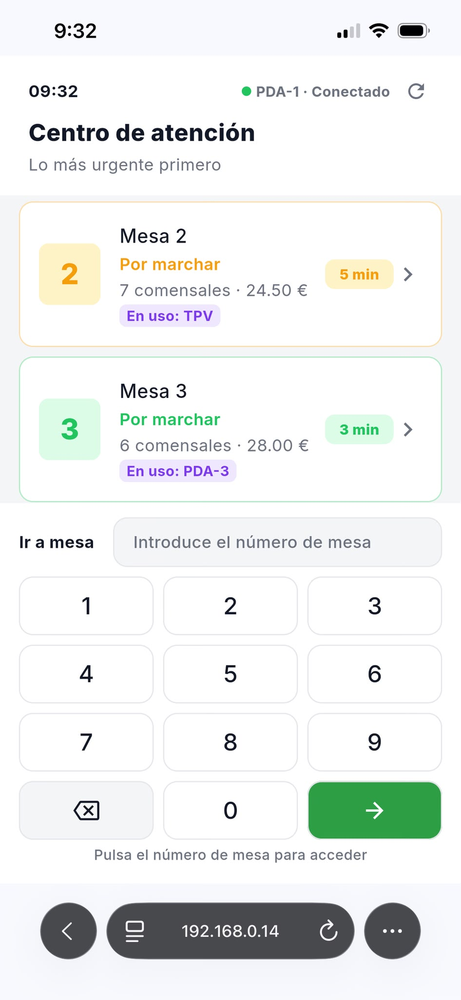

# ConectaMesa

Plataforma de comanda digital y TPV para hostelería desarrollada con Java, Spring Boot, PostgreSQL, Flutter y Docker.

> Proyecto iniciado como Trabajo Final de DAM y actualmente en evolución hacia una solución integral para bares, cafeterías y restaurantes.

---

# El problema

Muchos negocios de hostelería siguen dependiendo de procesos manuales para gestionar pedidos, coordinar camareros y controlar el estado de las mesas.

Esto suele provocar:

* Errores en comandas.
* Pérdida de tiempo en desplazamientos.
* Saturación de cocina en momentos de alta demanda.
* Dificultad para controlar el servicio en tiempo real.

ConectaMesa nace para digitalizar este flujo manteniendo el control operativo del restaurante.

---

# ¿Qué hace diferente a ConectaMesa?

La mayoría de soluciones QR envían automáticamente los pedidos a cocina.

ConectaMesa sigue una filosofía diferente:

* El cliente puede consultar la carta y realizar pedidos desde su dispositivo.
* El pedido queda registrado en el sistema.
* El camarero mantiene el control sobre cuándo la comanda pasa a cocina o barra.

Esto permite:

* Evitar avalanchas de pedidos.
* Mantener la coordinación del servicio.
* Reducir errores operativos.
* Adaptar el flujo al ritmo real del establecimiento.

---

# Flujo de funcionamiento

1. El cliente escanea un código QR.
2. Accede a una mesa mediante PIN.
3. Consulta la carta digital.
4. Realiza pedidos desde su dispositivo.
5. El camarero revisa y valida la comanda.
6. Cocina o barra recibe únicamente los pedidos confirmados.
7. El TPV gestiona el cobro y cierre de la mesa.

---

# Funcionalidades actuales

## Cliente

* Acceso mediante QR.
* Unión a mesa mediante PIN.
* Carta digital.
* Creación de pedidos.
* Consulta de cuenta.

## Personal

* Gestión de mesas.
* Gestión de comandas.
* Control de estados de pedido.
* PDA para camareros.
* TPV para cobros.

## Cocina y barra

* Recepción de comandas.
* Gestión de preparación.
* Impresión térmica.

---

# Arquitectura

## Frontend

* Flutter Web
* Flutter Desktop
* Flutter Mobile

## Backend

* Java 17
* Spring Boot
* Spring Data JPA
* Hibernate

## Base de datos

* PostgreSQL

## Infraestructura

* Docker
* Docker Compose

---

# Capturas

## PDA para camareros

Interfaz móvil para localizar mesas que requieren atención y gestionar el servicio en tiempo real.

---

## TPV

Pantalla principal utilizada por el personal para gestionar pedidos, mesas activas y cobros.

Características:

* Ticket en tiempo real.
* Gestión de productos por categorías.
* Control de cantidades.
* División de cuenta.
* Gestión simultánea de múltiples mesas.

---

# Objetivos técnicos

Durante el desarrollo del proyecto se han trabajado conceptos como:

* Diseño de APIs REST.
* Modelado de dominio.
* Persistencia con PostgreSQL.
* Gestión de estados de negocio.
* Arquitectura cliente-servidor.
* Contenerización mediante Docker.
* Comunicación entre aplicaciones Flutter y Spring Boot.

---

# Evolución del proyecto

Actualmente ConectaMesa continúa evolucionando hacia una solución TPV completa.

Líneas de desarrollo activas:

* Roles y permisos.
* Autenticación y seguridad.
* Gestión avanzada de usuarios.
* Estadísticas de negocio.
* Gestión de inventario.
* Multiestablecimiento.
* Evolución hacia plataforma SaaS.

---

# Mi papel en el proyecto

He participado en el diseño funcional y técnico de la plataforma, incluyendo:

* Diseño del modelo de dominio.
* Arquitectura backend.
* Desarrollo de APIs REST con Spring Boot.
* Modelado de base de datos PostgreSQL.
* Integración con Flutter.
* Contenerización mediante Docker.
* Definición de flujos de negocio y evolución funcional del producto.

---

# Sobre este repositorio

Este repositorio es una versión Showcase creada para presentar la arquitectura, funcionalidades y visión del proyecto.

El código fuente principal permanece privado mientras continúa su desarrollo.
