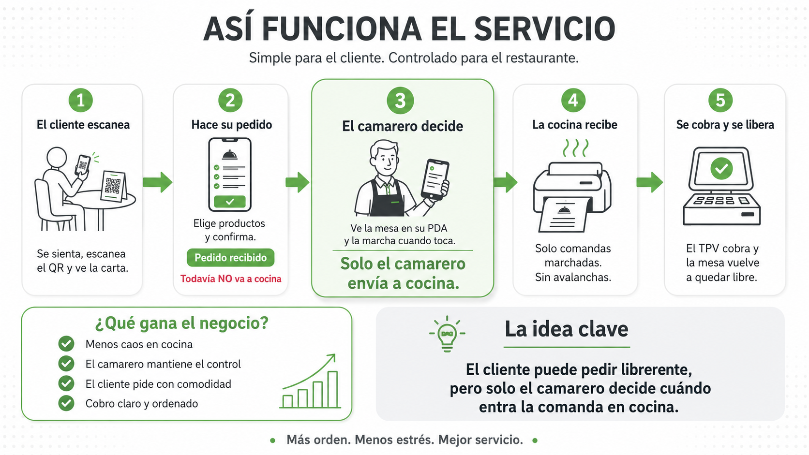

  

<h1 align="center">ConectaMesa</h1>

  Sistema de comanda digital y TPV para hostelería desarrollado con <strong>Java, Spring Boot, PostgreSQL, Flutter y Docker</strong>.

  Proyecto iniciado como Trabajo Final de DAM y actualmente evolucionando hacia una solución completa para la gestión de bares, cafeterías y restaurantes.

  

---

## El problema

Las soluciones de pedido por QR suelen enviar automáticamente todas las comandas a cocina.

En momentos de alta demanda esto puede provocar saturación, pérdida de control operativo y errores en el servicio.

## La propuesta

ConectaMesa mantiene al camarero dentro del flujo operativo.

El cliente puede consultar la carta y realizar pedidos desde su móvil, pero es el personal quien decide cuándo una comanda pasa a cocina o barra.

De esta forma se mejora la coordinación del servicio sin perder el control del negocio.

---

## Ecosistema

### Cliente

- Acceso mediante QR y PIN
- Carta digital
- Creación de pedidos
- Consulta de cuenta

### PDA para camareros

- Gestión de mesas
- Apertura de sesiones
- Gestión de pedidos
- Envío de comandas a cocina

### TPV

- Gestión de mesas activas
- Operación de pedidos
- Cobro de cuentas
- Liberación automática de mesas

### Cocina y barra

- Recepción de comandas
- Impresión térmica
- Gestión de producción

---

## Arquitectura

### Backend

- Java 17
- Spring Boot
- Spring Data JPA
- Hibernate

### Frontend

- Flutter Web
- Flutter Desktop
- Flutter Mobile

### Base de datos

- PostgreSQL

### Infraestructura

- Docker
- Docker Compose

---

## Capturas

### PDA para camareros

  

### TPV

  

---

## Aspectos técnicos trabajados

- Diseño de APIs REST
- Modelado de dominio
- Gestión de estados de negocio
- PostgreSQL
- Docker
- Arquitectura cliente-servidor
- Integración Flutter + Spring Boot
- Impresión térmica ESC/POS

---

## Mi participación

- Diseño funcional del producto
- Arquitectura backend
- Desarrollo de APIs REST con Spring Boot
- Modelado de base de datos PostgreSQL
- Integración con Flutter
- Dockerización del sistema
- Diseño de flujos de negocio para hostelería

---

## Estado actual

El proyecto continúa evolucionando hacia una solución TPV completa con nuevas funcionalidades orientadas a:

- Seguridad y control de accesos
- Gestión empresarial avanzada
- Analítica y métricas operativas
- Multiestablecimiento
- Modelo SaaS

---

## Nota

Este repositorio es una versión **Showcase** creada para presentar la arquitectura, funcionalidades y visión del proyecto.

El código fuente principal permanece privado mientras continúa su desarrollo.