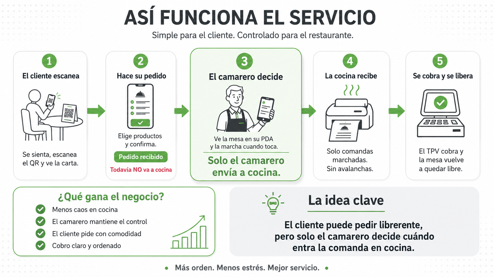
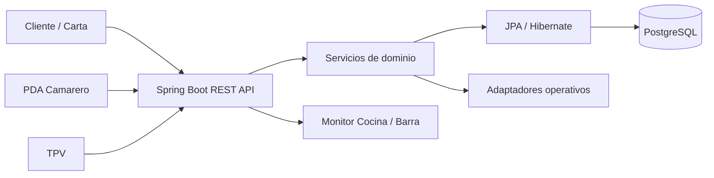
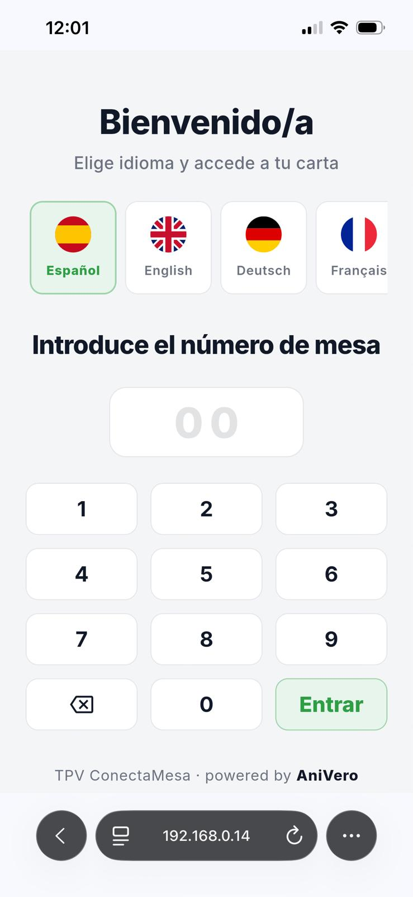
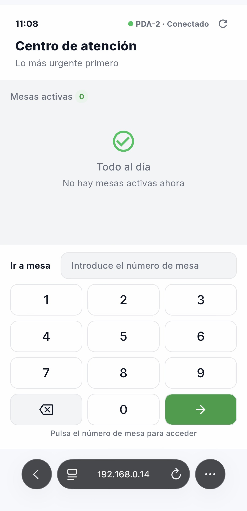
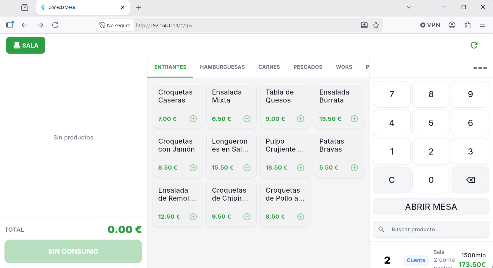

<!-- markdownlint-disable MD033 -->

# ConectaMesa — Backend Architecture Case Study

**Caso de estudio técnico de una plataforma de gestión operativa para hostelería.**

ConectaMesa nació como proyecto final de DAM y evolucionó hacia un sistema que coordina carta digital, pedidos, sala, cocina, caja y dispositivos de operación.

> Este repositorio público documenta arquitectura, decisiones y experiencia de producto. La implementación completa, configuración de infraestructura y lógica propietaria permanecen privadas.

## Contexto

<p align="center">
  
</p>

En un servicio de hostelería, digitalizar la toma de pedidos no consiste únicamente en enviar información desde un móvil. El sistema debe coordinar varios actores y mantener consistencia mientras cambian mesas, sesiones, pedidos y estados operativos.

ConectaMesa se diseñó alrededor de ese problema.

## Arquitectura de alto nivel


```mermaid
flowchart LR
    C[Cliente / Carta] --> API[Spring Boot REST API]
    P[PDA Camarero] --> API
    T[TPV] --> API
    API --> S[Servicios de dominio]
    S --> JPA[JPA / Hibernate]
    JPA --> DB[(PostgreSQL)]
    S --> O[Adaptadores operativos]
    API --> M[Monitor Cocina / Barra]
```

La implementación utiliza una arquitectura por capas para separar transporte HTTP, reglas de negocio y persistencia relacional.

```text
REST Controllers
      |
DTO / Validation
      |
Domain Services
      |
Repositories
      |
JPA / Hibernate
      |
PostgreSQL
```

## Problemas de ingeniería tratados

### Estados de negocio

Los pedidos y sesiones no son simples registros CRUD. Su comportamiento depende del estado actual y de transiciones permitidas.

Ejemplos de invariantes trabajados:

- impedir operaciones incompatibles con el estado del pedido;
- conservar coherencia entre sesión de mesa y pedidos;
- evitar cobros sobre operaciones todavía no consolidadas;
- mantener un flujo operativo verificable entre sala y producción.

### Consistencia y concurrencia

El sistema fue diseñado teniendo en cuenta que varios dispositivos pueden operar sobre una misma mesa al mismo tiempo.

La implementación privada incluye mecanismos de control transaccional y pruebas específicas de concurrencia. En este showcase se documenta el problema y la solución arquitectónica sin publicar los detalles que forman parte del producto.

### Persistencia relacional

El backend modela entidades como mesas, sesiones, pedidos, líneas, productos y pagos mediante JPA/Hibernate sobre PostgreSQL.

Las reglas de negocio permanecen en la capa de servicios en lugar de delegarse al cliente.

### Entorno reproducible

El producto se ejecuta mediante contenedores y Docker Compose, separando aplicación, persistencia y clientes.

La configuración sensible y los detalles reales de infraestructura no se publican en este repositorio.

## Testing

El proyecto privado dispone de pruebas automatizadas sobre reglas de negocio y comportamiento concurrente.

La estrategia incluye:

- tests unitarios de servicios;
- tests de estados e invariantes;
- tests de cálculo;
- tests de integración con persistencia;
- escenarios concurrentes sobre operaciones críticas.

Para revisar código Java ejecutable y una suite pública con JUnit 5, Mockito y Testcontainers:

[Quiz Backend — Spring Boot REST API](https://github.com/jav-anibal/quiz-backend-springboot)

## Stack técnico

**Backend:** Java · Spring Boot · Spring Data JPA · Hibernate

**Base de datos:** PostgreSQL

**Infraestructura:** Docker · Docker Compose · Nginx

**Clientes:** Flutter Web / Mobile / Desktop

**Testing:** JUnit 5 · Mockito · pruebas de integración y concurrencia

## Superficies del sistema

| Superficie | Responsabilidad |
| --- | --- |
| Carta / Cliente | Consulta de catálogo y creación de pedidos |
| PDA | Operación de sala y gestión de mesas |
| TPV | Gestión operativa y cobro |
| Cocina / Barra | Seguimiento del trabajo de producción |
| Backend | Reglas de negocio, consistencia y persistencia |

## Capturas

### AutoComanda

<p align="center">
  
</p>

### PDA

<p align="center">
  
</p>

### TPV

<p align="center">
  
</p>

## Mi participación

Proyecto desarrollado como iniciativa personal.

Responsabilidades principales:

- análisis funcional del servicio de hostelería;
- diseño del dominio y modelo relacional;
- arquitectura backend;
- desarrollo de APIs REST;
- reglas de negocio y gestión de estados;
- integración entre clientes y backend;
- contenedorización;
- diseño y ejecución de pruebas;
- evolución del producto a partir de pruebas operativas.

## Alcance de este repositorio

Este repositorio es deliberadamente un **case study**, no una distribución open-source del producto.

Su finalidad es permitir evaluar las decisiones de ingeniería y el alcance del sistema sin publicar código propietario, configuración operativa ni componentes que permitan reconstruir la plataforma completa.

---

**Anibal Solano**  
Backend Developer · Java · Spring Boot · PostgreSQL
